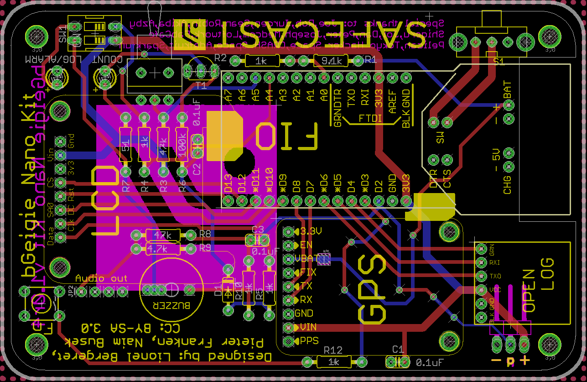

# Welcome to bGeigie Nano Kit project

This is a lighter version of the bGeigie Mini which is meant to fit in a Pelican Micro Case 1010.

# Requirements
* [Arduino Fio][3]
* [OpenLog][1]
* Adafruit [Ultimate GPS][7]
* [LND-7317][4] geiger pancake with Medcom iRover HV board
* [Monochrome 128x32][2] OLED screen
* 3.7V 1300mAh Lithium battery
* [Pelican 1010][9] micro-case

# Assembly

## Board design (bGeigieNanoKit v1.0r4)

PCB layout for the nano kit 1.0 reference build, designed by Lionel
Bergeret, Pieter Franken and Naim Busek (CC BY-SA 3.0). Source files
live in the [bGeigieNanoSafecast hardware folder][11].

## Pins assignment

| Arduino Fio pin | Target pin |
| :-----------: | :-----------: |
| VCC | VCC or Vin pin of the GPS, OpenLog, OLED and iRover (3.3v)|
| GND | GND pin of the GPS, OpenLog, OLED and iRover |
| D2 | pulse pin from the iRover |
| D3 | OLED RST pin |
| D4 | OLED CS pin |
| D5 | OLED DC pin |
| D6 | OLED Data pin |
| D7 | OLED Clk pin |
| D8 | TX pin of the GPS |
| D9 | RX pin of the GPS |
| D10 | TX pin of the OpenLog |
| D11 | RX pin of the OpenLog |
| D12 | GRN pin of the OpenLog |

# Power consumption

* **Fio**: 0.045mA sleep, 6mA at run time
* **OpenLog**: 2mA idle, 6mA at maximum recording rate
* **Adafruit Ultimate GPS**: 25mA acquisition, 20mA tracking
* **Monochrome OLED 128x32 0.91"**: 4mA 50% turn-on, 7.8mA 100% turn-on
* **Medcom iRover HV board** (LND-7317 supply): ~21mA, active regulation of the ~500V plateau

## Estimation

Total run-time current:

    6 (Fio) + 6 (OpenLog) + 20 (GPS tracking) + 4 (OLED) + 21 (iRover HV) = 57 mA

Battery life is then `capacity / current`. For a 1300 mAh cell: `1300 / 57 ≈ 22.8 h`, i.e. **~22h50m**.

This matches an early empirical measurement (`git log`, commit `6eefd91`): ~15 h
on a fully-charged 850 mAh Li-Ion battery, which back-solves to 850/15 ≈ 57 mA.

## Summary table

Assumes continuous logging with GPS tracking and no sleep mode. Real-world
durations are typically 10–20% shorter due to LDO dropout cutting the usable
battery capacity below the rated mAh, and occasional GPS re-acquisition spikes.

| Battery capacity (mAh) | Estimated log duration (days hh:mm) |
| :-----------: | :-----------: |
| 1300 | 0d 22:48 |
| 2600 | 1d 21:37 |
| 6600 | 4d 19:47 |

# Build process

The Makefile is a thin wrapper around [arduino-cli][10]. It targets the
Arduino Fio (`arduino:avr:fio`) and points the compiler at the vendored
Adafruit_GFX / Adafruit_SSD1306 libraries under `libraries/` (those have
local mods — Safecast splash bitmap and reduced font set — needed to fit
in the 328P's 32 KB of flash).

`arduino-cli` is auto-detected: if it isn't on `PATH`, the Makefile falls
back to the binary bundled inside `Arduino IDE.app` on macOS.

    make deps     # one-time: install the arduino:avr core
    make build    # compile sketch into ./build/
    make upload   # compile + flash (auto-detects /dev/cu.usbserial-*)
    make monitor  # serial monitor at 9600 baud
    make hex      # copy compiled .hex to ./bGeigieNano.hex (legacy name)
    make clean    # remove ./build/

Override the port with `make upload PORT=/dev/cu.usbserial-XXXX`.

## Using the prebuilt image

You can flash the bundled `bGeigieNano.hex` without recompiling, via
`arduino-cli` (replace the port with whatever the Fio enumerates as —
`/dev/cu.usbserial-XXXX` on macOS, `/dev/ttyUSB0` on Linux):

    arduino-cli upload --fqbn arduino:avr:fio --input-file bGeigieNano.hex --port /dev/cu.usbserial-XXXX

If you'd rather drive `avrdude` directly, use the one bundled with the
Arduino install (the Fio bootloader is Optiboot/STK500v1 at 57600 baud):

    avrdude -p atmega328p -c arduino -b 57600 -P /dev/cu.usbserial-XXXX -D -U flash:w:bGeigieNano.hex:i

# Usage
Once powered on the bGeigieNano will initiliaze a new log file on the SD card, setup the GPS and start counting the CPM.

# Sample log

    # NEW LOG
    # format=1.0.0nano
    $BNRDD,204,2012-09-20T16:53:58Z,776,63,33895,A,5641.7788,N,1411.8820,E,9861.20,A,109,9*46
    $BNRDD,204,2012-09-20T16:54:03Z,771,61,33956,A,5642.2047,N,1412.9433,E,9862.60,A,109,9*4D
    $BNRDD,204,2012-09-20T16:54:08Z,773,70,34026,A,5642.6305,N,1414.0053,E,9865.00,A,109,9*40
    $BNRDD,204,2012-09-20T16:54:13Z,768,59,34085,A,5643.0562,N,1415.0662,E,9866.80,A,108,9*4D
    $BNRDD,204,2012-09-20T16:54:18Z,765,59,34144,A,5643.4820,N,1416.1277,E,9868.10,A,108,9*4D
    $BNRDD,204,2012-09-20T16:54:23Z,776,70,34214,A,5643.9077,N,1417.1884,E,9870.40,A,90,10*4E
    $BNRDD,204,2012-09-20T16:54:28Z,790,69,34283,A,5644.3330,N,1418.2491,E,9871.30,A,90,10*44
    $BNRDD,204,2012-09-20T16:54:33Z,792,77,34360,A,5644.7576,N,1419.3115,E,9871.40,A,90,10*41
    $BNRDD,204,2012-09-20T16:54:38Z,800,73,34433,A,5645.1819,N,1420.3749,E,9872.60,A,90,10*4C
    $BNRDD,204,2012-09-20T16:54:43Z,784,57,34490,A,5645.6060,N,1421.4371,E,9873.10,A,89,10*4A
    $BNRDD,204,2012-09-20T16:54:48Z,787,58,34548,A,5646.0298,N,1422.4998,E,9874.10,A,89,10*40
    $BNRDD,204,2012-09-20T16:54:53Z,792,76,34624,A,5646.4534,N,1423.5620,E,9874.80,A,98,9*73
    $BNRDD,204,2012-09-20T16:54:58Z,804,75,34699,A,5646.8769,N,1424.6242,E,9874.30,A,98,9*74
    $BNRDD,204,2012-09-20T16:55:03Z,808,65,34764,A,5647.3011,N,1425.6873,E,9877.10,A,98,9*7F
    $BNRDD,204,2012-09-20T16:55:08Z,793,55,34819,A,5647.7236,N,1426.7514,E,9876.30,A,89,10*49
    $BNRDD,204,2012-09-20T16:55:13Z,799,65,34884,A,5648.1464,N,1427.8159,E,9876.10,A,98,9*7F
    $BNRDD,204,2012-09-20T16:55:18Z,795,55,34939,A,5648.5688,N,1428.8810,E,9877.80,A,98,9*7B
    $BNRDD,204,2012-09-20T16:55:23Z,774,49,34988,A,5648.9898,N,1429.9472,E,9878.50,A,85,10*46
    $BNRDD,204,2012-09-20T16:55:28Z,768,63,35051,A,5649.4098,N,1431.0137,E,9877.40,A,224,8*4A
    $BNRDD,204,2012-09-20T16:55:33Z,754,63,35114,A,5649.8297,N,1432.0798,E,9876.30,A,223,8*4F
    $BNRDD,204,2012-09-20T16:55:38Z,752,71,35185,A,5650.2496,N,1433.1447,E,9873.20,A,106,9*4C
    $BNRDD,204,2012-09-20T16:55:43Z,753,58,35243,A,5650.6698,N,1434.2092,E,9871.30,A,106,9*40
    $BNRDD,204,2012-09-20T16:55:48Z,765,70,35313,A,5651.0904,N,1435.2737,E,9869.50,A,106,9*4B

# Notes
## OpenLog config

The OpenLog should start listening at 9600bps and in Command mode. Here is the content of the CONFIG.TXT file you have to create on the microSD card:

    9600,26,3,2

## SoftwareSerial RX buffer

TinyGPS needs a 128-byte SoftwareSerial RX buffer or NMEA sentences get
truncated. The Makefile passes `-D_SS_MAX_RX_BUFF=128` as a build
property, which the system `SoftwareSerial.h` honors because it guards
its default with `#ifndef`. If you build with another tool, you must
either pass the same `-D` flag or patch `SoftwareSerial.h` directly; the
sketch has a compile-time `#error` that fires if the override is missing.

# Licenses
 * [InterruptHandler and bGeigieMini code][5] - Copyright (c) 2011, Robin Scheibler aka FakuFaku
 * [TinyGPS][6] - Copyright (C) 2008-2012 Mikal Hart
 * bGeigieNano - Copyright (c) 2012, Lionel Bergeret

  [1]: https://github.com/sparkfun/OpenLog "OpenLog"
  [2]: https://www.adafruit.com/products/661 "Monochrome 128x32 OLED"
  [3]: https://www.sparkfun.com/products/10116 "Arduino Fio"
  [4]: http://www.lndinc.com/products/17/ "LND-7317"
  [5]: https://github.com/fakufaku/SafecastBGeigie-firmware "SafecastBGeigie-firmware"
  [6]: http://arduiniana.org/libraries/tinygps/ "TinyGPS"
  [7]: https://www.adafruit.com/products/746 "Ultimate GPS"
  [9]: http://www.pelican.com/cases_detail.php?Case=1010 "Pelican 1010"
  [10]: https://arduino.github.io/arduino-cli/ "arduino-cli"
  [11]: https://github.com/Safecast/bGeigieNanoSafecast/tree/master/hardware "bGeigieNanoSafecast hardware"
